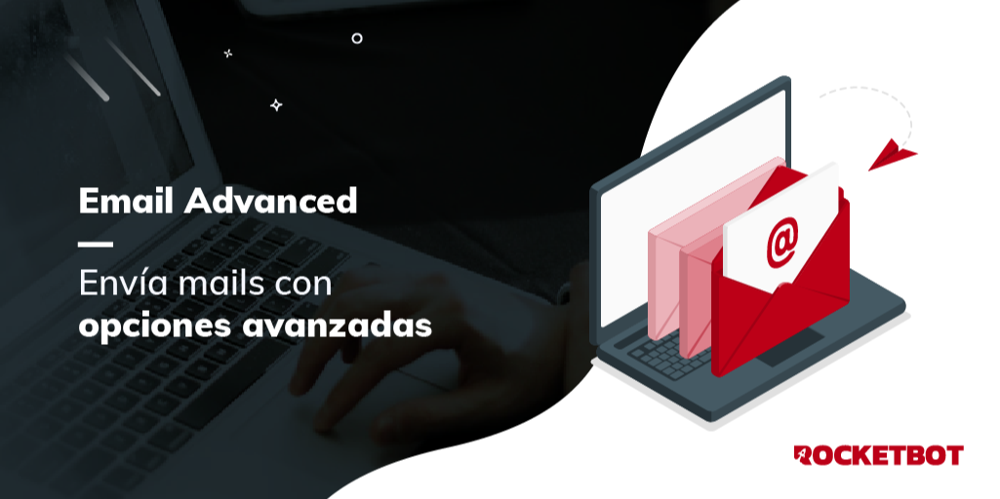

# Email avanzado
  
Module with advanced options for mail management  

*Read this in other languages: [English](Manual_emailAdvanced.md), [Español](Manual_emailAdvanced.es.md).*
  

## How to install this module
  
__Download__ and __install__ the content in 'modules' folder in Rocketbot path  

## How to use this module
The emailAdvanced module must be used in conjunction with the native email module. As a first action, we must go to the modules section and look for the "Email" module, then "SMTP-IMAP" and use the "Configure server" command. We must complete the fields with the data of the server, port, password and mail. Check SSL if necessary. Once this is done, we will be able to use the module commands.

## Description of the commands

### Send advanced email
  
Command to send html format email, cc and multiple files
|Parameters|Description|example|
| --- | --- | --- |
|To|Here we put the recipients to whom we want to send an email|user@email.com,person@mail.net|
|Cc|Here we put the recipients to whom we want to send an email|cc@email.com,cc2@mail.net|
|Subject|Here we put the subject of the email|Check out this Rocketbot message|
|Message|Here we put the message that we want to send|Hi person. This message was sent from Rocketbot. Bye|
|Attachment|Here we put the files that we want to attach|path/to/file.ext|
|attach multiple files|Here we put the files that we want to attach|path/to/folder|

### Move email to folder
  
Módulos para mover emails de carpeta para servidores de correos IMAP
|Parameters|Description|example|
| --- | --- | --- |
|ID de mail|We put the ID of mail to move|ID mail|
|Origin folder|We put the origin folder|Carpeta origen|
|Carpeta de destino|We put the destination folder|carpeta|
|Asignar a variable|We put the variable to which the result will be assigned|variable|

### Read all data from email
  
Read all data from email
|Parameters|Description|example|
| --- | --- | --- |
|ID de mail|We put the ID of the mail to read|ID|
|Asignar a variable|We put the variable where we want to save the data|variable|
|Email save path|We put the path where we want to save the mail|C:/Users/User/Desktop|
|Attachment save path|We put the path where we want to save the attachments|C:/Users/User/Desktop|

### Mark mail as unread
  
Mark mail as unread by ID
|Parameters|Description|example|
| --- | --- | --- |
|ID de mail|We put the ID of the mail to mark as unread.|ID|

### List email folders
  
List email folders
|Parameters|Description|example|
| --- | --- | --- |
|Set to var|We put the variable where we want to save the result.|Variable|

### Connect Imap
  
User only if native command not working to read emails
|Parameters|Description|example|
| --- | --- | --- |
|Usuario|Usuario de la cuenta de correo|user@example.com|
|Password|Password of the email account|******|
|Server|Email server|host.imap.xys|
|Port|Connection port|517|
|Assign result to a Variable|Variable where the result will be stored|Variable|
|SSL Conection |Connect with SSL|True|

### Connect SMTP
  
User only if native command not working connection
|Parameters|Description|example|
| --- | --- | --- |
|Usuario|Enter the e-mail with which we will connect to the server|user@example.com|
|Password|Enter the password with which we will connect to the server|******|
|Server|Enter the server with which we will connect to the server|host.smtp.xys|
|Port|Enter the port with which we will connect to the server|517|
|Assign result to a Variable|Enter the name of the variable in which we want to save the result|Variable|
|SSL Conection |Activate the SSL connection|True|

### Validate emails
  
Validate emails
|Parameters|Description|example|
| --- | --- | --- |
|Email|Put the email to validate if exists|example_mail@server.com|
|Result|Result of the validation|resultado_email|

### Forward email for ID
  
Forward email for ID
|Parameters|Description|example|
| --- | --- | --- |
|Email ID|Email ID to forward|355|
|Email|Email that will receive the mail|test@email.com|
|Subject|Subject of the email|Subject|

